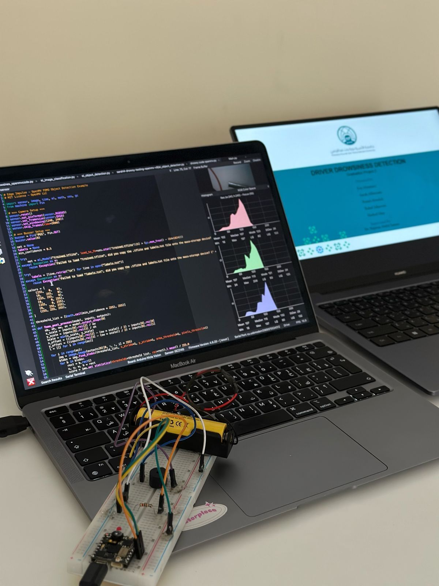
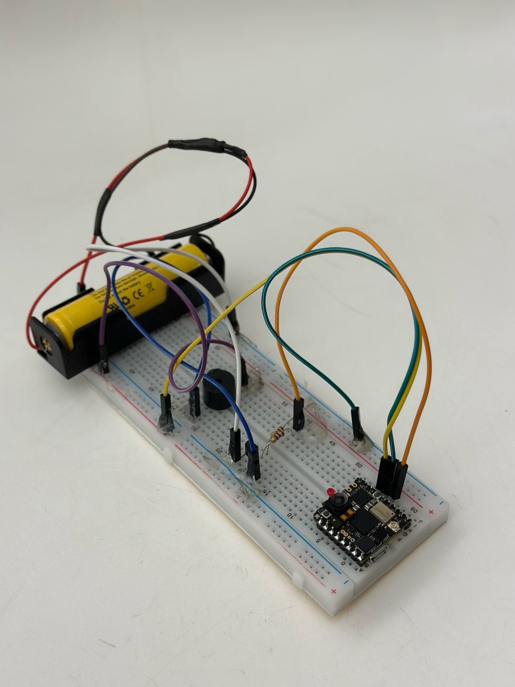
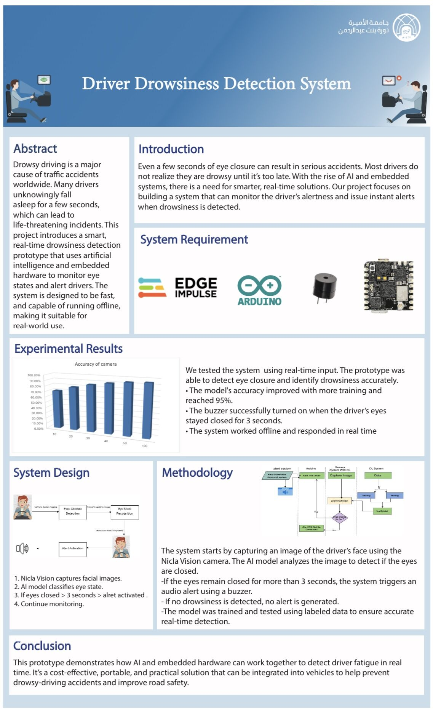

# AI-Based Driver Drowsiness Detection System

##  Overview

Driver drowsiness is one of the leading causes of road accidents worldwide. This project presents a real-time system that detects driver fatigue using artificial intelligence and embedded hardware.
The system monitors eye closure and triggers an alert when drowsiness is detected.

---

## Objective

* Detect driver drowsiness in real-time
* Trigger an alert when eyes remain closed for a certain duration
* Provide a lightweight, offline-capable solution

---

## Technologies Used

* Edge Impulse (AI model training & deployment)
* Arduino / ESP32 Camera
* Embedded Systems
* Python (Model training & testing)

---

## System Architecture

1. Camera captures driver face
2. AI model processes image
3. Classifies: **Drowsy / Non-Drowsy**
4. If drowsy → buzzer alert is triggered

---

## Project Overview



---

## Hardware Setup (Arduino Board & Nicla Vision Camera)



---

## Results

* Accuracy improved with training and reached ~94%
* Real-time detection achieved
* System works offline
* Buzzer activates when drowsiness is detected

---

## Alert Mechanism

If the driver's eyes remain closed for a few seconds:
➡️ The buzzer is activated immediately

---

## Project Structure

```
AI-Based-Driver-Drowsiness-Detection-System/
├── README.md
├── model/
│   └── drowsiness_project_sarah_final.ipynb
├── arduino/
│   ├── final_drowsiness_alert.ino
│   └── ei-drowsy-model.zip
├── docs/
│   ├── GP1-presentation.pdf
│   ├── GP2-presentation.pdf
│   ├── GP2-report.pdf
└── poster.jpeg
```

---

## How to Run

1. Upload the Arduino code to the ESP32 device
2. Connect the buzzer and camera module
3. Deploy the Edge Impulse model
4. Run the system
5. Monitor output via Serial or live detection

---

## Documentation

Detailed documentation is available in the `doc/` folder:

* Presentations
* Final report

---

## Poster



---

## Conclusion

This project demonstrates how AI and embedded systems can be combined to create a practical, real-time safety solution.
The system is cost-effective, portable, and suitable for real-world deployment.

---

## Author

Rahaf

---
